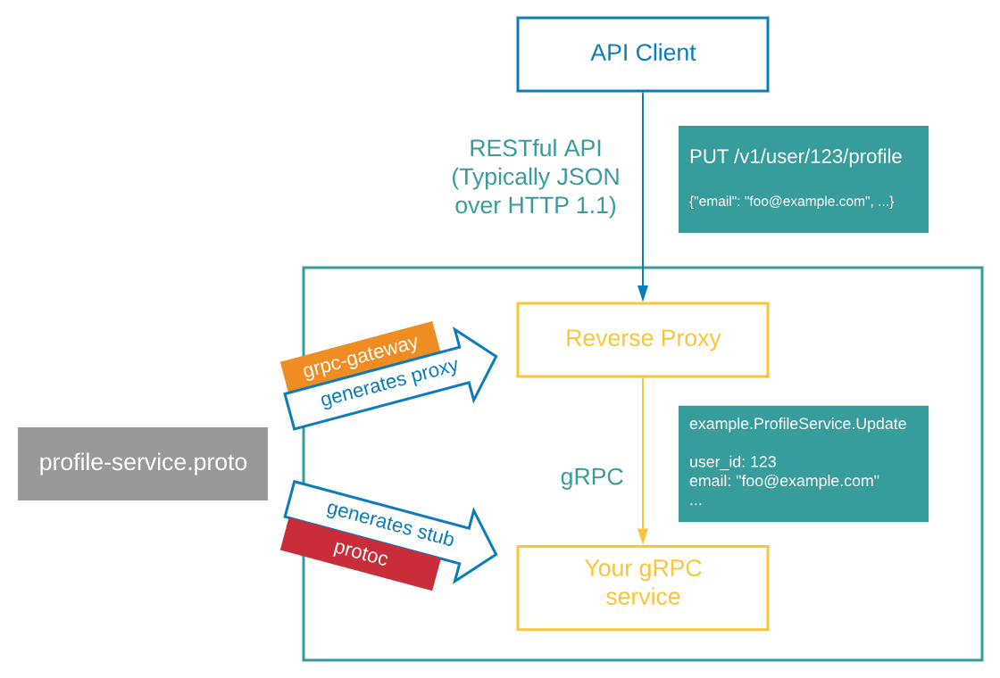

# gmicro-proto

创建`golang/order/v0.0.1`标签tag

```bash
./run.sh order v0.0.1 chyiyaqing chyiyaqing@gmail.com
```

创建`golang/payment/v0.0.1`标签tag

```bash
./run.sh payment v0.0.1 chyiyaqing chyiyaqing@gmail.com
```

创建`golang/shipping/v0.0.1`标签tag

```bash
./run.sh shipping v0.0.1 chyiyaqing chyiyaqing@gmail.com
```

打Tag

```bash
git tag v0.0.8 && git push origin v0.0.8
```

## Requisition

| Tool | Description | Installation |
|:-----|:------------|:-------------|
| ptotobuf | protocol buffer | [install protoc](https://google.github.io/proto-lens/installing-protoc.html) |
| protoc-gen-go | Plugin for the Google protocol buffer compiler to generate Go code. | [install protoc-gen-go](https://grpc.io/docs/languages/go/quickstart/) |
| protoc-gen-go-grpc | This project aims to provide that HTTP+JSON interface to your gRPC service. | [install protoc-gen-go-grpc](https://grpc.io/docs/languages/go/quickstart/) |
| protoc-gen-grpc-gateway | Plugin for Google protocol buffer compiler to generate a reverse-proxy, which converts incoming RESTful HTTP/1 requests gRPC invocation. | [install grpc-gateway](https://github.com/grpc-ecosystem/grpc-gateway#installation) |
| protoc-gen-openapiv2 | Plugin for Google protocol buffer compiler to generate open API config file. | [install openapiv2](https://github.com/grpc-ecosystem/grpc-gateway#installation) |

### gRPC

> gRPC时应用程序之间进行通信的一种现代方式。gRPC使用HTTP/2,流式传输,Protobuf和Message来创建高性能、实时服务

### gRPC-Gateway

> gRPC-Gateway为gRPC服务生成一个反向代理服务器，将Restful/JSON转换为gRPC.gRPC-Gateway将在你的gRPC服务上创建一个层，该层将充当客户端的Restful/JSON服务，gRPC-Gateway根据Protocol Buffer的gRPC服务定义生成代码.



#### Prerequisties

```bash
go install github.com/grpc-ecosystem/grpc-gateway/v2/protoc-gen-grpc-gateway@latest
go install google.golang.org/protobuf/cmd/protoc-gen-go@latest
go install google.golang.org/grpc/cmd/protoc-gen-go-grpc@latest
```

* Translates HTTP/JSON requests to gRPC and back
* Simple annotation in proto files
* Provides Swagger/OpenAPI generator
* Widely used within gRPC community


## Buf CLI 构建工具

> Buf CLI时现代、快速、高效的Protobuf API管理的终极工具，借助format、Lint，重大更改检测和代码生成等功能，Buf为Protobuf开发和维护提供了全面的解决方案.

检查Buf版本

```bash
$ buf --version
1.48.0
```

```bash
$ buf config init

buf.yaml -- Buf Cli 配置工作区文件
```

### [swagger-ui](https://github.com/swagger-api/swagger-ui)

> Swagger UI是HTML,JavaScript和CSS资产的集合，可通过符合Swagger的API动态生成漂亮的文档

Download [swagger-ui v5.18.2](https://github.com/swagger-api/swagger-ui/releases/tag/v5.18.2) and copy the contents of the /dist folder to your server.


## Set Up

```bash
APPLICATION_HTTP_PORT=10000 go run cmd/main.go
```